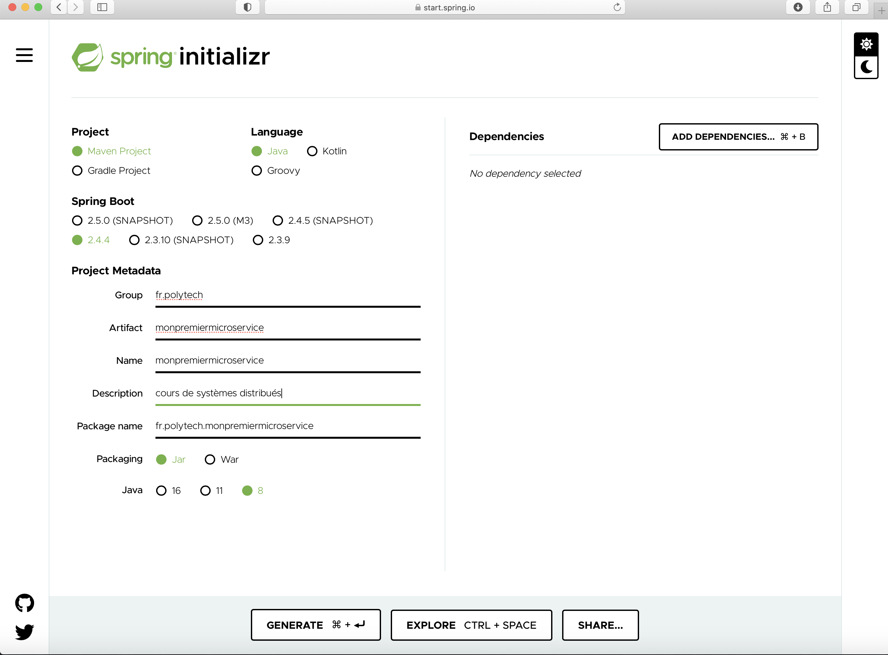

# Spring Initializr
Soring Initializr vous permet - à l'image d'un restaurant qui vous propose de composer (choix des ingédients) votre sandwitch - de &laquo; composoer votre application &raquo;. Pour faire simple, les ingrédients pour Spring Initializr représentent les différentes dépendances dont on a besoin. L'objectif dans ce qui suit est de vous montrer les étapes à suivre pour définir votre premier microservice.  

Vous pouvez créer votre microservice, en utilisant directement votre IDE préféré, moyennant l'instalation de &laquo; Springs Tools &raquo;. Je vais dans un premier temps vous montrer comment le créer en utilisant Spring Initializr et puis, dans un deuxième temps, en utilisant un IDE.  

Pourquoi alors vais-je vous monter comment définir votre premier microservice, en passant par Spring Initializr, puisqu'on peut le faire directement à partir d'un IDE ? La réponse est que 

Connectez-vous sur le site [https://start.spring.io](https://start.spring.io). 

Poiur ajouter des starters et des dépendances, vous pouvez utiliser le bouton ``ADD DEPENDENCIES`` et un moteur de recherche textuel sera lancé. Il suffit de taper le nom de la dépendance ou de parcourir la longue liste pour en choisir ceux dont vous avez besoin. Dans ce qui suit l'objectif est de développer un microservice de vente en ligne (gestion d'un ensemble de produits). Nous n'allons pas utiliser toutes les dépendences dont on a besoin, pour vous permettre de bien assimiler les différents concepts. Nous allons commencer par définir les métadonnées dans notre projet. Un projet Spring est avant tout un projet Maven, nous allons fixer les valeurs (en outre) : 

- GroupId : fr.polytech
- ArtifactId : monpremiermicroservice
- Name : cours de systèmes distribués
- Packaging : JAR
- JAVA : 8 

Une fois que ces métadonnées sont définies : 

1. Ajouter la dépendance ``Spring Web WEB Build web, including RESTful, applications using Spring MVC. Uses Apache Tomcat as the default embedded container``. 
2. Avant de générér le projet, s'assurer que vous avez bien choisi une version de Java d'installée sur votre ordinateur. Je vous conseille d'utiliser la version 8. Je vais y revenir un peu plus loin, dans le cadre de ce cours, sur cette version. 
3. Cliquer sur le bouton ``GENERATE``et télécharger l'application. 
4. Extraire l'application générée. 
5. L'importer en utilisant un IDE de votre choix. Pour ma pert, j'utilisera tout au long de ce cours IntelliJ.  

Pour ceux qui ont fait le même choix que moi, les étapes à suivres pour importer le projet ainsi généré sont : 

1. Une fois IntelliJ est lancé, cliquer sur ``Import Project``.
2. Sélectionner le fichier pom.xml du dossier de l'application et cliquer sur le bouton ``open``. 

